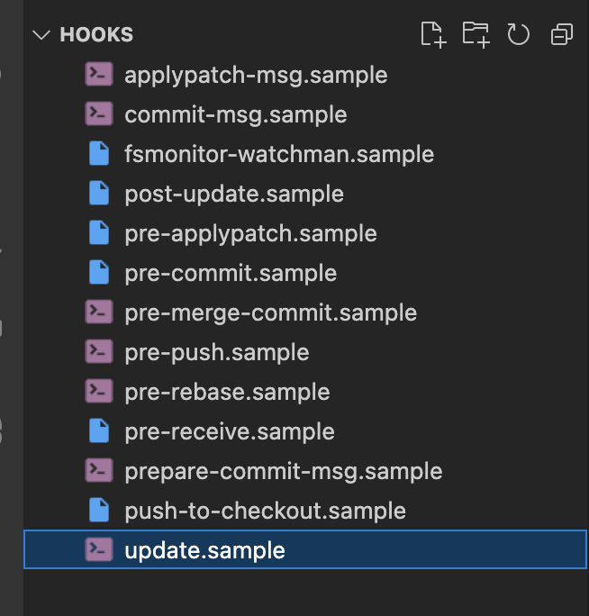

# my-project

1. 在当前目录下创建 vue+ts 项目

```bash
npm create vite@latest . -- --template vue
```

2. 改为 ts

```bash
# 安装依赖
npm install typescript ts-loader --save-dev
# 添加tsconfig.json文件
# 添加类型声明文件
# js后缀改ts
```

3. git 提交规范配置

```bash
# 安装 @commitlint/config-conventional @commitlint/cli
npm install @commitlint/config-conventional @commitlint/cli --save-dev
# 安装 husky
npm install husky --save-dev
# 添加 prepare 脚本，自动下载.husky文件
npm set-script prepare "husky install"


# --no-install 参数表示强制npx使用项目中node_modules目录下的husky依赖包
# --edit $1  参数是必须的，这个参数的意思是：存储 commit message 的临时文件路径是 $1, 而$1 则是 Git 传给 commit-msg hook 的参数，它的值是 commit message 的临时存储文件的路径，默认情况下是 .git/COMMIT_EDITMSG。如果不传这个参数，那么 commitlint 将无法得知当前的 commit message 是什么
npx husky add .husky/commit-msg 'npx --no-install commitlint --edit "$1"'


# 显示隐藏文件
ls -d .*
# 查看.git/hooks
code .git/hooks
```


参考：

- [前端 Git-Hooks 工程化实践 ](https://www.cnblogs.com/dtux/p/16419271.html)
- [谁动了我的代码！(协同仓库该有的规范)🔥](https://segmentfault.com/a/1190000041403438)
